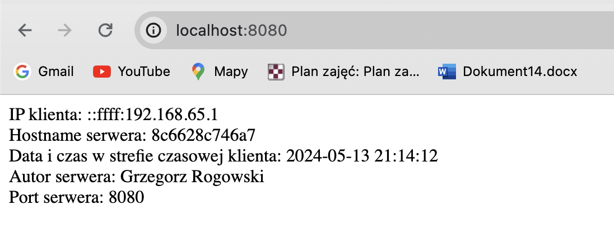

zad3 a: docker build -t zad1 . 
zad3 b: docker run --rm --name zad1 -d -p 8080:8080 zad1
zad3 c: docker logs zad1 lub zajrzenie w logi w docker desktop (tag_ss.png)
zad3 d: docker histroy zad1 (warstwy.jpeg)

